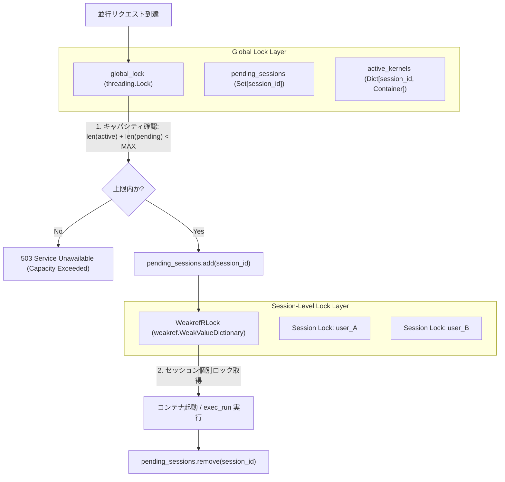

# Concurrency Control (並行制御)

## 1. 概要

LibreChat Custom RCE では、複数のユーザーやチャットスレッドから同時にリクエストが到達した場合でも、データ競合や最大セッション数（`RCE_MAX_SESSIONS`）の超過が発生しないよう、スレッドセーフな二重防御構造（`WeakrefRLock` と `pending_sessions`）を採用しています。

## 2. 並行制御の二重防御アーキテクチャ



## 3. 主要コンポーネントと実装メカニズム

### 3.1 セッション個別ロック (`WeakrefRLock`)
* **目的**: 同一セッションに対する複数の連続・並行リクエスト（例: ファイルアップロード直後のコード実行）がコンテナ内で競合しないように排他制御を行います。
* **メモリリーク対策**: Python の `weakref.WeakValueDictionary` を用いてロックオブジェクトを管理します。使用されなくなったセッションのロックオブジェクトは自動的にガベージコレクションされ、メモリリークを防止します。

```python
class WeakrefRLock:
    """A wrapper around threading.RLock that supports weak references."""
    def __init__(self):
        self._lock = threading.RLock()

    def __enter__(self):
        return self._lock.__enter__()

    def __exit__(self, exc_type, exc_val, exc_tb):
        return self._lock.__exit__(exc_type, exc_val, exc_tb)

    def acquire(self, blocking=True, timeout=-1):
        return self._lock.acquire(blocking, timeout)

    def release(self):
        return self._lock.release()

class KernelManager:
    def __init__(self):
        self.active_kernels = {}
        self.lock = threading.Lock()
        self.session_locks = weakref.WeakValueDictionary()
        self.session_locks_lock = threading.Lock()

    def _get_session_lock(self, session_id: str) -> WeakrefRLock:
        with self.session_locks_lock:
            lock = self.session_locks.get(session_id)
            if lock is None:
                lock = WeakrefRLock()
                self.session_locks[session_id] = lock
            return lock
```

### 3.2 起動中セッションの追跡 (`pending_sessions`)
* **課題**: コンテナの起動処理（`docker.containers.run`）には数十ミリ秒〜数百ミリ秒のレイテンシが存在します。多数のリクエストが同時に新規コンテナを作成しようとした場合、作成完了前のチェックをすり抜けて `RCE_MAX_SESSIONS` を超過してしまうレースコンディションが発生します。
* **対策**: グローバルロック下で `len(self.active_kernels) + len(self.pending_sessions) >= RCE_MAX_SESSIONS` を事前チェックし、作成処理に入る直前に `self.pending_sessions.add(session_id)` でセッション枠を予約します。コンテナ起動完了または失敗時に確実に破棄されます。

## 4. 設計不変条件
* **フォールバック順序の維持**: セッションID取得からロック取得までのフローを変更しないこと。
* **ロックの局所化**: グローバルロックは短時間の辞書・セット操作のみに限定し、コンテナ起動やI/O処理を含む重い処理は必ずセッション個別ロックで行うこと。

## 5. 関連ドキュメント
* [System Overview](./overview.md) - 全体システム構成
* [Session Resolution](../domain/session-resolution.md) - セッションIDの自動解決
