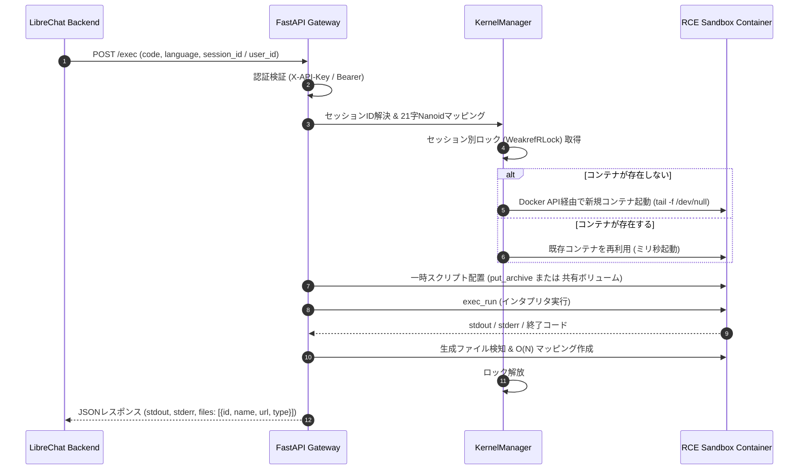

# System Overview

## 1. 概要

LibreChat Custom RCE（Remote Code Execution）は、LibreChatのCode Interpreter機能に準拠したサンドボックス型実行バックエンドです。FastAPIをゲートウェイとして、ユーザーセッションごとに動的にDockerコンテナを割り当て・管理し、多言語（Python, Bash, R）のコードを安全に実行します。

## 2. システムコンポーネント構成

システムは以下の主要コンポーネントで構成されます。

```mermaid
graph TD
    Client["LibreChat UI / WebUI"] -->|HTTP / REST API| Proxy["Caddy / Reverse Proxy (Optional)"]
    Proxy -->|Port 8000| Gateway["FastAPI Gateway (main.py)"]
    
    subgraph "API ゲートウェイ層"
        Gateway --> Auth["API Key 認証検証 (secrets.compare_digest)"]
        Auth --> SessionRes["Session ID 自動解決 & Nanoid マッピング"]
        SessionRes --> KM["KernelManager (ライフサイクル & ロック管理)"]
    end

    subgraph "コンテナ管理層"
        KM -->|TCP 通信 (API制限付き)| SockProxy["Docker Socket Proxy (tecnativa/docker-socket-proxy)"]
        SockProxy -->|Docker API| Engine["Docker Engine (Host Daemon)"]
    end

    subgraph "サンドボックス隔離実行層"
        Engine -->|docker exec_run| C1["RCE Container: session_1 (Dockerfile.rce)"]
        Engine -->|docker exec_run| C2["RCE Container: session_2 (Dockerfile.rce)"]
        Engine -->|docker exec_run| CN["RCE Container: session_N (Dockerfile.rce)"]
    end
```

### コンポーネントの役割
1. **FastAPI Gateway (`main.py`)**:
   - LibreChat互換のエンドポイント（`/exec`, `/upload`, `/download/{session_id}/{file_id}`, `/files` 等）を提供。
   - セッションID解決、Nanoid ID変換、AST解析による評価結果抽出、ファイルの入出力を仲介。
2. **KernelManager**:
   - アクティブなサンドボックスコンテナのライフサイクル（作成、再利用、TTL破棄）を管理。
   - `WeakrefRLock` によるセッション単位の排他制御および `pending_sessions` によるキャパシティ管理。
3. **Docker Socket Proxy**:
   - ホストの `docker.sock` を直接マウントさせず、必要なエンドポイント（`POST /containers/create`, `POST /containers/{id}/exec` 等）のみを許可してAPIコンテナに中継。
4. **RCE Sandbox Containers (`Dockerfile.rce`)**:
   - `tail -f /dev/null` で常時待機する非ルート（UID 1000）コンテナ。
   - CPU/メモリ制限、ネットワーク遮断環境下でコードを実行。

## 3. リクエスト処理シーケンス

コード実行（`/exec`）時の基本的なシーケンスは以下の通りです。



## 4. 関連ドキュメント
* [Concurrency Control](./concurrency.md) - 並行制御とレースコンディション防御
* [Security Model](./security.md) - 多層防御とセキュリティガイドライン
* [Session Resolution](../domain/session-resolution.md) - セッションIDのフォールバック仕様
* [Docker Setup](../infrastructure/docker-setup.md) - Docker Compose構成とストレージモード
