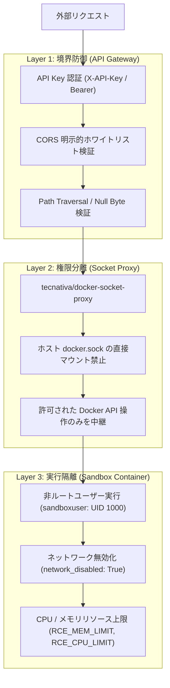

# Security Model (セキュリティモデル)

## 1. 概要

LibreChat Custom RCE は、ユーザーから送られる任意のプログラミングコードを実行するサンドボックス環境であるため、多層防御（Defense in Depth）の原則に基づいた強固なセキュリティ境界を設計・維持しています。

## 2. セキュリティ防御層

## 3. ガードレールおよび重要要件

### 3.1 Docker Socket Proxy による権限制限
* **禁止事項**: APIサーバーコンテナにホストの `/var/run/docker.sock` を直接マウントすることは厳禁です。
* **実装**: `docker-compose.yml` で `docker-socket-proxy` サービスを介し、`CONTAINERS=1`, `POST=1`, `EXEC=1` などの最小限必要な機能のみをAPIサーバーに提供します。

### 3.2 非ルートユーザー実行 (`sandboxuser`)
* サンドボックスコンテナ（`Dockerfile.rce`）は `sandboxuser` (UID: 1000, GID: 1000) で動作します。
* コンテナエスケープ等の脆弱性が存在した場合でも、ホスト権限の奪取を防ぎます。

### 3.3 デフォルトのネットワーク無効化
* サンドボックスコンテナはデフォルトで `network_disabled: True`（`RCE_NETWORK_ENABLED=false`）として起動します。
* 実行コードからの外部への情報流出（C2通信、データ持ち出し）を物理的に遮断します。

### 3.4 ディレクトリトラバーサル（Path Traversal）対策
* ファイルのアップロード・ダウンロード・スクリプト配置処理において、ファイル名に `..` や絶対パス、Nullバイト（`\x00`）が含まれていないかを厳格にサニタイズ・検証します。

### 3.5 CORS におけるワイルドカード `*` の使用禁止
* `CORS_ALLOWED_ORIGINS` の設定において `*` の使用を禁止します。
* 明示的なオリジン（例: `http://localhost:3080`, `http://127.0.0.1:3000` 等）のホワイトリストのみを許可します。

### 3.6 API認証のタイミング攻撃対策
* `LIBRECHAT_CODE_API_KEY` の検証には `secrets.compare_digest` を使用し、タイミング攻撃によるキーの推測を防止します。

## 4. 関連ドキュメント
* [System Overview](./overview.md) - 全体システム構成
* [Sandbox Image](../infrastructure/sandbox-image.md) - Dockerfile.rce の非ルート設計
* [Configuration](../infrastructure/configuration.md) - 環境変数設定
