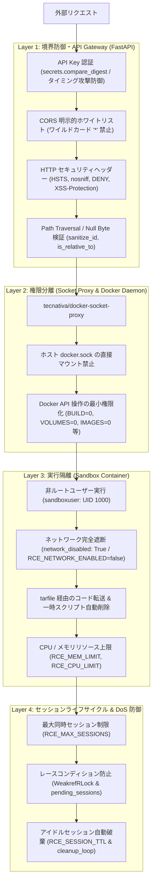

# Security Model (セキュリティモデル)

## 1. 概要

LibreChat Custom RCE は、ユーザーから送られる任意のプログラミングコードを実行するリモートコード実行（RCE）環境です。そのため、単一の防御壁に依存せず、多層防御（Defense in Depth）の原則に基づいた強固なセキュリティ境界を設計・維持しています。

## 2. セキュリティ防御層（多層防御アーキテクチャ）

---

## 3. 各防御層の詳細仕様

### 3.1 境界防御・API層 (Layer 1)

#### 1. タイミング攻撃（Timing Attack）耐性を持つ API Key 認証
* `LIBRECHAT_CODE_API_KEY` の検証には `secrets.compare_digest` を使用し、文字列長や一致文字数による応答時間の微細な差異（サイドチャネル攻撃）から API キーを推測されるのを防止します。
* `Bearer` トークン、`X-API-Key` ヘッダー、クエリパラメータなど複数の伝送経路を安全にパース・検証します。

#### 2. CORS におけるワイルドカード `*` の完全禁止
* `CORS_ALLOWED_ORIGINS` において、クレデンシャル付き通信を許可した状態での `*`（ワイルドカード）指定を禁止し、起動時にバリデーションエラーとして弾きます。
* 明示的なオリジン（例: `http://localhost:3080`, `http://127.0.0.1:3000` 等）のホワイトリストのみを許可します。

#### 3. セキュア HTTP レスポンスヘッダー (`SecurityHeadersCORSMiddleware`)
* 全ての API レスポンスに対し、ブラウザ側の脆弱性悪用を防ぐヘッダーを自動付加します：
  - `X-Content-Type-Options: nosniff` (MIMEタイプ Sniffing 防止)
  - `X-Frame-Options: DENY` (クリックジャッキング防止)
  - `X-XSS-Protection: 1; mode=block` (XSS フィルター強制)
  - `Strict-Transport-Security: max-age=31536000; includeSubDomains` (HSTS)
  - `Referrer-Policy: no-referrer` (リファラ情報漏洩防止)
* **ダウンロードエンドポイントの例外処理**: `/download` 等のファイルダウンロード系パスでは、ブラウザのダウンロードブロック挙動を回避しつつ CORS を維持する分離処理を行っています。

#### 4. ディレクトリトラバーサル（Path Traversal）の徹底防止
* **ID サニタイズ (`sanitize_id`)**: セッションID・ファイルIDに対して英数字、ハイフン、アンダースコア（`[a-zA-Z0-9_-]`）以外の文字を完全除去します。
* **パス検証**:
  - ファイル名に `..`、絶対パス、Nullバイト（`\x00`）が含まれていないかを `Path.parts` および `is_absolute()` で遮断。
  - ボリュームマウント利用時は、対象ファイルパスの `resolve()` 結果がセッションディレクトリの `resolve()` 配下にあることを `path.is_relative_to(abs_session)` で検証し、シンボリックリンクや相対パス脱出を防止。

---

### 3.2 権限分離層 (Layer 2)

#### 1. Docker Socket Proxy による特権分離
* **禁止事項**: API サーバーコンテナにホストの `/var/run/docker.sock` を直接マウントすることは厳禁です。
* **実装**: `tecnativa/docker-socket-proxy` を中継コンテナとして挟み、API サーバーからは内部ネットワーク経由でのみ Docker API にアクセスさせます。
* **不要エンドポイントの完全無効化**:
  - 許可: `CONTAINERS=1`, `POST=1`, `EXEC=1`
  - 遮断（最小権限化）: `BUILD=0`, `IMAGES=0`, `NETWORKS=0`, `VOLUMES=0`, `SECRETS=0`, `CONFIGS=0`, `PLUGINS=0`, `SWARM=0`
  - 万が一 API サーバーが侵害された場合でも、ホスト上の他のコンテナ・イメージ・ネットワークへの横展開（ラテラルムーブメント）を防ぎます。

---

### 3.3 実行隔離・サンドボックス層 (Layer 3)

#### 1. 非ルートユーザー実行 (`sandboxuser: 1000`)
* サンドボックスコンテナ（`Dockerfile.rce`）は `sandboxuser` (UID: 1000, GID: 1000) で動作します。
* Linux カーネルの脆弱性やコンテナエスケープ手法が存在した場合でも、ホストの root 権限奪取を防ぎます。

#### 2. デフォルトのネットワーク完全無効化
* サンドボックスコンテナはデフォルトで `network_disabled: True`（`RCE_NETWORK_ENABLED=false`）として起動します。
* 悪意あるスクリプトによる外部 C2 サーバーへの通信、暗号資産マイニング通信、イントラネット内の不正スキャン（SSRF）を物理的に遮断します。

#### 3. tarfile (put_archive) による安全なコード注入と自動クリーンアップ
* **インジェクション回避**: 実行対象のコードを `python -c "<code>"` やシェル引数として直接コマンドラインに渡さず、`tarfile` ストリーム（`put_archive`）を用いてコンテナ内の独立した一時ファイル（`exec_<uuid>.<ext>`）として書き込みます。
* これにより、シェルのエスケープミスやコマンドライン長上限（`ARG_MAX`）によるバッファオーバーフローを防止します。
* **一時ファイル自動破棄**: 実行完了後は `finally` 節で一時スクリプトファイルを確実に削除（`rm`）し、コンテナ内ストレージの肥大化と過去コードの漏洩を防ぎます。

#### 4. ハードウェアリソース制限
* コンテナ単位で CPU クォータ（`RCE_CPU_LIMIT` / `nano_cpus`）およびメモリ上限（`RCE_MEM_LIMIT`）を設定。
* 無限ループや Fork 爆弾（メモリ枯渇攻撃）によるホスト全体の DoS を防ぎます。
* コンテナ停止時の `remove: True` により、停止済みコンテナのゴミ残りによるディスク圧迫を防止します。

---

### 3.4 セッションライフサイクル & DoS 防御 (Layer 4)

#### 1. キャパシティ管理とレースコンディション防御
* **最大セッション数制限 (`RCE_MAX_SESSIONS`)**: ホスト上で同時に起動できるサンドボックスコンテナ数を制限。
* **二重防御構造**:
  - `WeakrefRLock` によるセッション単位の排他制御。
  - `pending_sessions` セットを用いた起動中スロットの事前確保。複数リクエストが同時にコンテナを起動しようとした際の最大上限突破（レースコンディション）を完全に防止します。

#### 2. アイドルセッション自動クリーンアップ (`cleanup_loop`)
* バックグラウンドタスクが定期的に `RCE_SESSION_TTL`（デフォルト10分など）を超過したアイドルセッションを検出し、コンテナ停止および作業ディレクトリの削除を自動実行します。
* ゾンビコンテナや放置セッションによるリソースの枯渇を防ぎます。

---

## 4. 関連ドキュメント

* [System Overview](./overview.md) - 全体システム構成
* [Concurrency Control](./concurrency.md) - 並行制御とキャパシティ管理
* [Multi-Language Code Execution](../domain/code-execution.md) - 安全なコード実行パイプライン
* [File Handling](../domain/file-handling.md) - パスサニタイズとファイルマッピング
* [Docker Setup](../infrastructure/docker-setup.md) - Socket Proxy と Compose 構成
* [Sandbox Image](../infrastructure/sandbox-image.md) - 非ルートイメージ構築仕様

