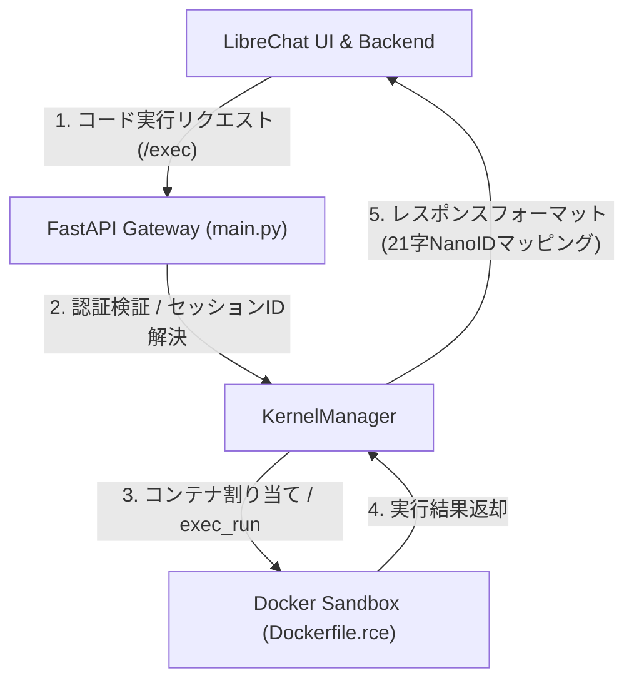

# LibreChat Code Interpreter 統合・設定詳細ガイド

本ドキュメントは、LibreChatと外部のカスタムPython API環境（FastAPI + Docker RCE）を安全かつ堅牢に統合し、実運用に耐えうる構成を確立するための詳細な設定ガイドです。

---

## 1. 統合アーキテクチャの概要

本プロジェクトで提供されている Code Interpreter API（Custom RCE）は、以下の図式で LibreChat と連携します。



---

## 2. APIサーバー（FastAPI）の設定

APIサーバーは、LibreChatからの要求を受け取り、隔離コンテナへ安全にプロキシするためのゲートウェイとして動作します。

### 認証設定とトラブルシューティング環境変数

APIサーバーの認証および動作制御は、以下の環境変数で行います。

| 環境変数名 | 推奨値 / 例 | 説明 |
|---|---|---|
| `LIBRECHAT_CODE_API_KEY` | `your_secure_secret_key` | APIアクセス認証用の共有キー（必須）。LibreChat側のキーと一致させる必要があります。 |
| `DISABLE_CODE_API_AUTH` | `false` | `true` に設定するとAPIキーの検証をスキップします。LibreChat `v0.8.6` 以降では認証が正常に動作するため通常は `false` で運用してください。旧バージョンとの互換性維持や開発・テスト時にのみ使用します。 |
| `RCE_DATA_DIR` | `/path/to/project/sessions` | ホスト側のセッションファイル保存先（絶対パス）。これを指定すると「ボリュームマウントモード」で動作し、高速なファイル転送が実現します。 |

---

## 3. LibreChat 側の連携設定

LibreChatがカスタムAPIへ安全にリクエストを送信できるように、LibreChatコンテナの環境変数を定義します。

### `.env` の設定項目

```env
# 1. カスタムAPIのコンテナURLを指定（ポート8000番）
LIBRECHAT_CODE_BASEURL=http://code-interpreter-api:8000

# 2. APIサーバー側と完全に一致するAPIキーを設定
LIBRECHAT_CODE_API_KEY=your_secure_secret_key
CODE_API_KEY=your_secure_secret_key
```

### `librechat.yaml` での有効化

LibreChat本体の設定ファイルで、Code Interpreter機能を有効化します。

```yaml
version: "1.1.5"
codeInterpreter:
  enabled: true
```

---

## 4. LLMプロバイダー（Ollama / Sakura AI / LiteLLM）の統合設計

外部のカスタムLLMやローカルLLMをLibreChatのAgent Builderやチャット機能で安定して利用するための設定例です。

### A. Ollama（ローカルLLM）の堅牢な設定
Ollama を `librechat.yaml` に `ollama` エンドポイントとして直接記述すると、Zod バリデーションエラーを誘発し設定全体の読み込みが破壊される原因になります。また、別プロジェクトで動いている場合はホスト名解決ができません。
最も確実な解決策は、Ollama が提供する OpenAI 互換 API エンドポイントを `custom` エンドポイントとして登録することです。

**1. `librechat.yaml` の設定**
```yaml
endpoints:
  custom:
    - name: "Ollama"
      apiKey: "ollama"                         # 必須のダミーキー
      baseURL: "${OLLAMA_BASE_URL}/v1"
      models:
        default: ["qwen2.5-coder:3b"]
        fetch: true                           # Ollamaから利用可能なモデル一覧を自動取得
      titleConvo: true
      summarize: true
      modelDisplayLabel: "Ollama Local"
```

**2. `.env` の設定 (ホスト経由の接続)**
```env
OLLAMA_BASE_URL=http://host.docker.internal:11434
```

**3. `docker-compose.librechat.yml` での名前解決**
LibreChatサービスに `extra_hosts` を追記して、ホスト側へのゲートウェイを確立します。
```yaml
extra_hosts:
  - "host.docker.internal:host-gateway"
```

---

## 5. API側での高度な自動フォールバック設計（防衛設計）

本API（`main.py`）には、LibreChat上流に存在する深刻な仕様バグや制約を自動で補うための防衛策が標準で内蔵されており、設定なしで正常系を維持します。

### ① 日本語ファイル名文字化けバグへの防衛
* **原因**: LibreChat上流のファイルアップロードミドルウェア（`multer`/`busboy`）は、ファイル名を Latin1 として解釈し、非ASCII文字を一律アンダースコア（`_`）に置換・サニタイズしてしまいます。
* **API側の対処**: 
  - サンドボックス環境に UTF-8 ロケールを適用。
  - ファイルリストの取得時、シェルコマンドの `ls` を避け、Pythonの `os.listdir` を用いてリストを完全にJSONエンコードして取得することで、文字化けやスペースによる崩れを防止。
  - ファイルダウンロード時には RFC 5987 に完全準拠した `Content-Disposition` ヘッダーを生成し、ブラウザ側での文字化けを防止。

### ② セッションID欠落バグへの防衛
* **原因**: LibreChatの `@librechat/agents` モジュールは、ファイルを添付しない実行フローにおいて、APIへ送信するボディのルートに `session_id` を載せないという致命的な設計漏れがあります。これにより、通常であれば毎回新規コンテナが立ち上がり、状態が喪失します。
* **API側の対処 (自動)**:
  1. **`user_id` によるバインド**: リクエストに `user_id` が含まれている場合、自動的に `user_<user_id>` をセッションIDとしてバインドし、コンテナを再利用。
  2. **直前セッションのキャッシュ再利用**: ファイルがアップロードされた直後（5分以内）にセッションIDが欠落した実行リクエストが来ても、グローバルキャッシュから直前のセッションIDを自動で引き当てて連携。
  
これにより、無駄なコンテナ再生成が抑制され、起動レイテンシがミリ秒単位に低減し、セッション間の変数やファイル状態が安定して維持されます。