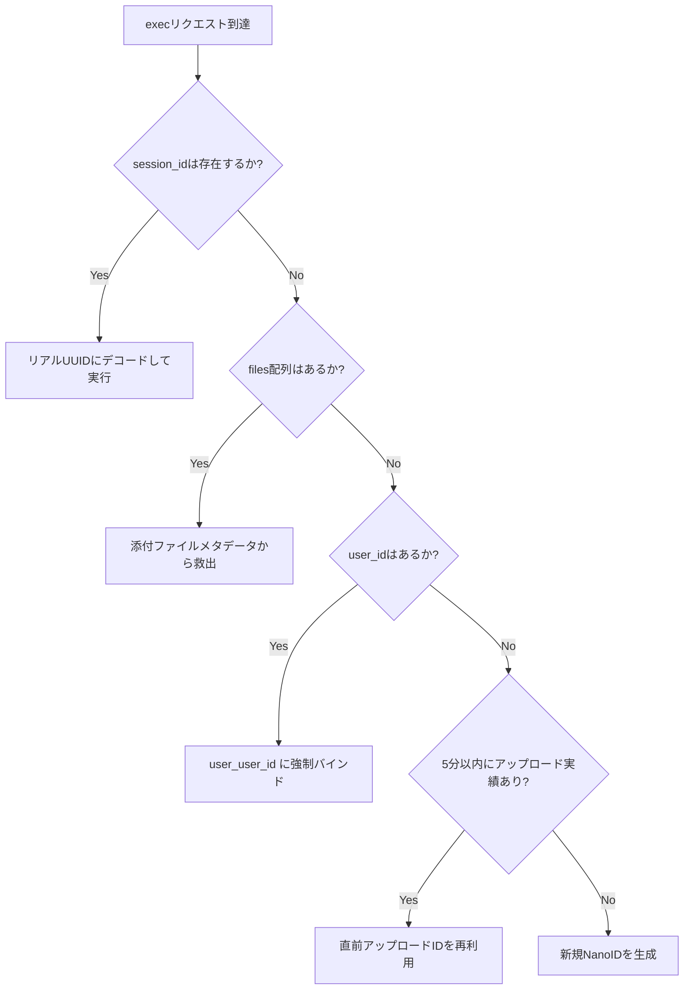

# セッションID解決仕様と自動フォールバック設計リファレンス

本ドキュメントは、LibreChatのクライアント側ツールにおいて発生する仕様上の制限（セッションIDの欠落）に対し、本RCE API（Custom RCE）がどのように自動フォールバックを実行し、状態（変数やファイルシステム）の維持と超高速なコンテナ再利用（ミリ秒起動）を実現しているかの内部設計をまとめた技術リファレンスです。

セッションの寿命管理（TTL）、並列セッション制限の拡張、あるいは新規エンドポイントの追加など、将来の開発継続時に参照すべき設計要件を定義します。

---

## 1. 上流（LibreChat）のセッションID送信仕様と現状の課題

LibreChatのエージェントおよびツール連携パッケージ（`@librechat/agents` 内の `CodeExecutor.ts`）には、以下のリクエスト仕様が存在します。

* **ファイルレス実行時のID欠落**:
  ユーザーがファイルを添付せずにチャット中でプログラムコードのみを実行する際、クライアント側ツールは `session_id` をAPIリクエストボディのルートレベルから完全に除外して POST リクエスト（`/exec`）を送信します。
* **想定される深刻な課題**:
  API側が素直にこのリクエストを受け取ると、毎メッセージごとに「新規セッション」であると誤認します。結果として、毎ターン新しいDockerコンテナを起動するため、**数秒におよぶ起動レイテンシ**が発生し、さらに前ターンで定義された変数や作成されたファイルといった**状態（ステート）が完全に喪失**してしまいます。

---

## 2. API側（`main.py`）の自動フォールバック設計

本APIは、上流側のこの制約をカバーし、完全に意識させない状態でステートフルかつ高速な実行環境を提供するために、以下の**3重の自動フォールバック機構**を内蔵しています。

### ① 添付ファイルメタデータからの救出
ルートレベルの `session_id` が空であっても、`req.files` 配列の要素内に存在する `session_id` や `storage_session_id` を最優先で走査し、セッションIDを特定してマッピングします。

### ② `user_id` への強制バインド（中核設計）
リクエストボディに `user_id` が含まれている場合、セッションIDとして `user_<user_id>` を割り当てて実行コンテナを再利用します。
* **メリット**: 同一ユーザーからの要求であれば、セッションIDが欠落していても常に同じコンテナにルーティングされます。これにより、チャットセッション間での状態の維持と、コンテナ再起動なしのミリ秒起動が担保されます。

### ③ `LAST_UPLOADED_SESSION_ID` による直前アップロード連携
ファイルをアップロードした直後（5分以内）に、API連携バグやクライアント側ツールの仕様バグによりセッションIDが途切れた実行要求が来た場合、メモリ上にキャッシュされた「直前にアップロードが成功したセッションID」を自動で引き当てて再利用します。
* **メリット**: 「ファイルをアップロードした直後であるのに、セッションIDの不一致で実行コンテナからファイルが見えない」という問題を完全に防止しています。

---

## 3. 将来の開発継続・拡張における設計指針（開発リファレンス）

今後、本プロジェクトの開発を継続する際には、必ず以下の設計方針を遵守してください。

### ① `effective_session_id` の解決フローの維持
`/exec` などの新しいエンドポイントを増設する場合、あるいはセッションの割り当てルールを変更する場合は、必ず `main.py` の `run_code` 内で実装されている上記の解決フロー（`files` -> `user_id` -> `LAST_UPLOADED_SESSION_ID`）を通した上で、`real_session_id` を特定する構造を崩さないでください。

### ② クリーンアップ寿命（TTL）との整合性
フォールバックによって長期間維持されるコンテナ（`user_<user_id>` など）は、放置されるとリソースを消費し続けるため、`KernelManager.cleanup_sessions()` による自動クリーンアップ（`RCE_SESSION_TTL` 経過後の自動停止・削除）が非常に重要です。
セッションの割り当て仕様を拡張する際は、必ずクリーンアップ監視ループが正しく機能し、ゾンビコンテナを作らない安全設計を維持してください。
