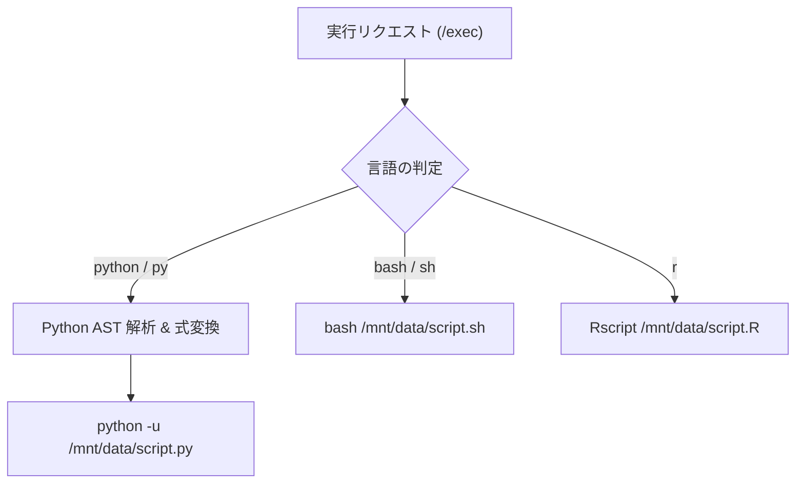

# Multi-Language Code Execution (多言語コード実行)

## 1. 概要

LibreChat Custom RCE は、Pythonだけでなく Bash や R 言語のコード実行に対応しています。また、Jupyter Notebook 風の末尾評価式の自動出力や、Matplotlib による日本語グラフの自動描画をサポートしています。

## 2. 言語ごとの実行フロー



## 3. Python AST 解析による末尾式自動評価

Jupyter Notebook のように、スクリプトの末尾に記述された式（例: `df.head()` や `x + 1`）の結果を自動的に標準出力へ表示させるため、Python AST（抽象構文木）を解析してコードを動的に変換します。

```python
# 元のコード
x = 10
x * 2

# AST変換後のイメージ
x = 10
__last_res__ = x * 2
if __last_res__ is not None:
    print(repr(__last_res__))
```

* **動作**:
  - コードの最後の文が式（`ast.Expr`）である場合、自動的に `__last_res__` 変数へ代入し、`None` でなければ `print(repr(__last_res__))` を呼び出す構文ノードを付加します。
  - 構文エラー（`SyntaxError`）がある場合は、変換を行わずそのまま実行して標準のTracebackを出力させます。

## 4. Matplotlib 日本語描画の自動サポート

サンドボックスイメージ（`Dockerfile.rce`）内に `fonts-ipafont-gothic` を導入し、Pythonの `sitecustomize.py` で `japanize_matplotlib` を自動インポートしています。

```python
# sitecustomize.py
try:
    import japanize_matplotlib
except ImportError:
    pass
```

* **メリット**:
  ユーザーがコード内で明示的に `import japanize_matplotlib` やフォント設定を記述しなくても、日本語を含むグラフタイトルや軸ラベルが文字化け（豆腐）せず、警告なしで描画されます。

## 5. 関連ドキュメント
* [Sandbox Image](../infrastructure/sandbox-image.md) - Dockerfile.rce の構築仕様
* [Overview](../architecture/overview.md) - システム全体アーキテクチャ
