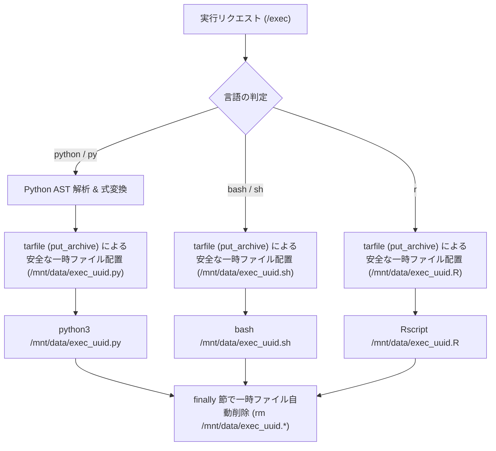
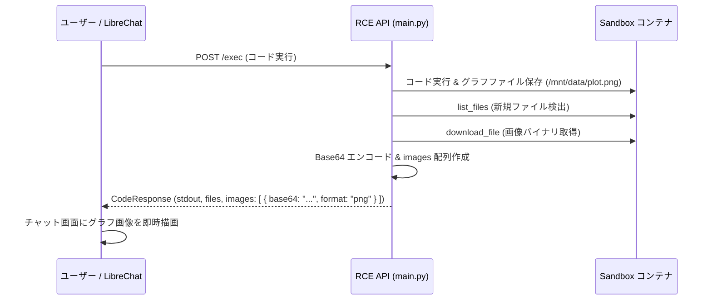

# Multi-Language Code Execution (多言語コード実行)

## 1. 概要

LibreChat Custom RCE は、Pythonだけでなく Bash や R 言語のコード実行に対応しています。また、Jupyter Notebook 風の末尾評価式の自動出力や、Matplotlib による日本語グラフの自動描画をサポートしています。

## 2. 言語ごとの実行フロー



## 3. 安全なコード注入と自動クリーンアップ (Security & Isolation)

* **コマンドラインインジェクション防止**:
  コードを `python -c "..."` やシェル引数として渡すと、引用符のエスケープ漏れによる意図しないコマンド実行や、OS のコマンドライン長上限（`ARG_MAX`）による実行失敗が発生します。
* **実装**:
  実行対象コードを `tarfile` ストリームに変換し、Docker API の `put_archive` 経由でコンテナ内の `/mnt/data/exec_<uuid>.<ext>` に安全に転送します。
* **一時ファイル自動破棄**:
  実行完了後は `finally` ブロックで一時スクリプトファイルを確実に `rm` 削除し、過去の実行コード残留やコンテナ内ディスク容量の消費を防ぎます。

## 4. Python AST 解析による末尾式自動評価

Jupyter Notebook のように、スクリプトの末尾に記述された式（例: `df.head()` や `x + 1`）の結果を自動的に標準出力へ表示させるため、Python AST（抽象構文木）を解析してコードを動的に変換します。

```python
# 元のコード
x = 10
x * 2

# AST変換後のイメージ
x = 10
__last_res__ = x * 2
if __last_res__ is not None:
    print(repr(__last_res__))
```

* **動作**:
  - コードの最後の文が式（`ast.Expr`）である場合、自動的に `__last_res__` 変数へ代入し、`None` でなければ `print(repr(__last_res__))` を呼び出す構文ノードを付加します。
  - 構文エラー（`SyntaxError`）がある場合は、変換を行わずそのまま実行して標準のTracebackを出力させます。

## 4. Matplotlib 日本語描画の自動サポート

サンドボックスイメージ（`Dockerfile.rce`）内に `fonts-ipafont-gothic` を導入し、Pythonの `sitecustomize.py` で `japanize_matplotlib` を自動インポートしています。

```python
# sitecustomize.py
try:
    import japanize_matplotlib
except ImportError:
    pass
```

* **メリット**:
  ユーザーがコード内で明示的に `import japanize_matplotlib` やフォント設定を記述しなくても、日本語を含むグラフタイトルや軸ラベルが文字化け（豆腐）せず、警告なしで描画されます。

## 5. 生成画像（グラフ）の自動キャプチャと UI インライン描画

Matplotlib や Seaborn、Plotly 等で生成されたグラフ画像（`.png`, `.jpg`, `.svg`, `.webp` 等）を、LibreChat チャット UI 内で即座にインライン描画させるため、以下の自動パイプラインを実装しています。



### 5.1 レスポンス構造
```json
{
  "stdout": "Plot saved\n",
  "exit_code": 0,
  "status": "success",
  "session_id": "nanoid_session_id_21",
  "files": [
    {
      "id": "nanoid_file_id_21c1",
      "name": "plot.png",
      "url": "/api/files/code/download/nanoid_session_id_21/nanoid_file_id_21c1",
      "type": "image/png",
      "session_id": "nanoid_session_id_21",
      "storage_session_id": "nanoid_session_id_21",
      "inherited": false
    }
  ],
  "images": [
    {
      "name": "plot.png",
      "format": "png",
      "data": "iVBORw0KGgoAAAANSUhEUg...",
      "base64": "iVBORw0KGgoAAAANSUhEUg...",
      "url": "/api/files/code/download/nanoid_session_id_21/nanoid_file_id_21c1",
      "type": "image/png"
    }
  ]
}
```

### 5.2 知見: コンテナ内 `python3 -c` ワンライナー構文の落とし穴
* **問題**: `python3 -c "import os; for x in y: ..."` のようにセミコロンの直後に `for` 文を記述すると、Python インタプリタが `SyntaxError: invalid syntax` で異常終了し、ファイル一覧が空になってしまう。
* **対策**: 改行を含む明示的なマルチラインスクリプト文字列を渡し、安全かつ確実に走査を実行。

## 6. 関連ドキュメント
* [File Handling & UTF-8](./file-handling.md) - ファイル管理と深い階層の走査
* [Sandbox Image](../infrastructure/sandbox-image.md) - Dockerfile.rce の構築仕様
* [Overview](../architecture/overview.md) - システム全体アーキテクチャ
