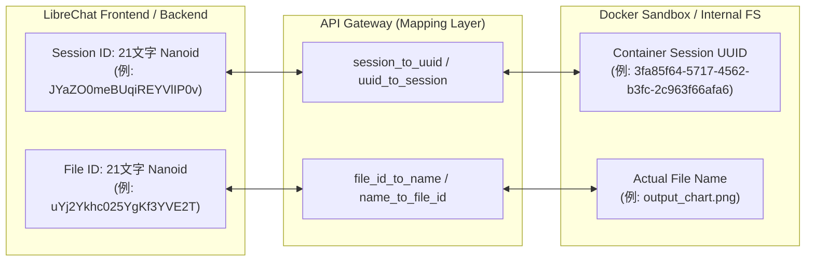

# Nanoid ID Mapping (21文字Nanoid双方向マッピング)

## 1. 概要

LibreChatバックエンドは、生成されたファイルのダウンロードやチャットUI上でのプレビュー表示を行う際、内部の `isValidID()` 関数によってセッションIDおよびファイルIDの形式を厳格に検証します。

### `isValidID` の正規表現仕様
```javascript
/^[A-Za-z0-9_-]{21}$/
```

* **制約**:
  - 正確に **21文字** の英数字および `_`, `-` である必要があります。
  - 標準の36文字UUID（例: `550e8400-e29b-41d4-a716-446655440000`）や、ドットを含むファイル名（例: `image.png`）をそのままIDとして返却すると、LibreChatバックエンドが `400 Bad Request` を返してダウンロードやプレビューが失敗します。

## 2. Nanoid 双方向マッピング設計

本APIでは、内部的なコンテナ管理やファイル実体管理（UUID/実ファイル名）を保ちつつ、LibreChatとの通信インターフェースで21文字Nanoidを保証するマッピング層を備えています。



## 3. レスポンススキーマ仕様

`/exec` エンドポイントからのレスポンスは以下の形式に準拠します。

```json
{
  "stdout": "実行標準出力...",
  "stderr": "",
  "exit_code": 0,
  "status": "success",
  "session_id": "JYaZO0meBUqiREYVlIP0v",
  "files": [
    {
      "id": "uYj2Ykhc025YgKf3YVE2T",
      "name": "sales_trend.png",
      "url": "/api/files/code/download/JYaZO0meBUqiREYVlIP0v/uYj2Ykhc025YgKf3YVE2T",
      "type": "image/png",
      "session_id": "JYaZO0meBUqiREYVlIP0v",
      "storage_session_id": "JYaZO0meBUqiREYVlIP0v",
      "inherited": false
    }
  ],
  "images": [
    {
      "name": "sales_trend.png",
      "format": "png",
      "data": "iVBORw0KGgoAAAANSUhEUg...",
      "base64": "iVBORw0KGgoAAAANSUhEUg...",
      "url": "/api/files/code/download/JYaZO0meBUqiREYVlIP0v/uYj2Ykhc025YgKf3YVE2T",
      "type": "image/png"
    }
  ]
}
```

* `session_id`: 21文字Nanoid
* `files[].id`: 21文字Nanoid
* `files[].url`: `/api/files/code/download/{21字セッションNanoid}/{21字ファイルNanoid}`
* `images[]`: 生成されたグラフ画像（`.png`, `.jpg`, `.svg`, `.webp` 等）をチャット UI 内で即時インライン描画するための Base64 エンコードデータ


## 4. 関連ドキュメント
* [Session Resolution](./session-resolution.md) - セッションIDの解決優先順位
* [File Handling & UTF-8](./file-handling.md) - ファイル管理と日本語ファイル名
