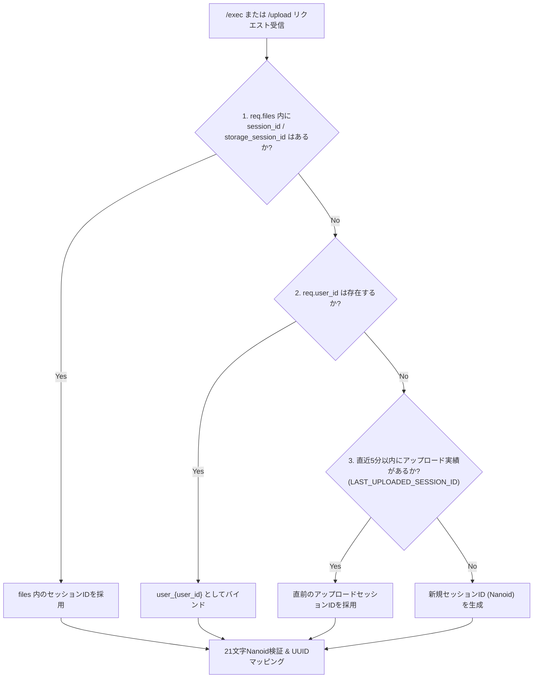

# Session ID Resolution & Fallback (セッションID解決とフォールバック)

## 1. 概要

LibreChatのクライアント側ツール（`@librechat/agents` 等）では、ファイルを添付しないコード実行時などに、リクエストルートの `session_id` が省略されて送信される仕様上の特性があります。

セッションIDが欠落するたびに新しいコンテナを作成すると、起動レイテンシの増大（数秒）と、前のターンで定義された変数やファイルなどの実行状態（ステート）が失われてしまいます。本APIでは、これを防ぎステートフルな実行とミリ秒起動を維持するため、**3段階の自動フォールバック機構**を実装しています。

## 2. セッションID解決フローと優先順位

### 優先順位（設計不変条件）
1. **リクエスト内のファイルメタデータ**:
   `files` 配下の各要素に含まれる `session_id` もしくは `storage_session_id`。
2. **ユーザーIDバインド**:
   `user_id` が存在する場合は `user_{user_id}`。同一ユーザーからのファイルレス実行を同一コンテナにルーティングします。
3. **直前アップロードセッションキャッシュ**:
   直近5分以内（300秒）にアップロードが成功した `LAST_UPLOADED_SESSION_ID`。

## 3. 実装上の注意点
* **不変条件の維持**: このフォールバック順序やロジックを変更・削除してはいけません。
* **有効期限管理**: `LAST_UPLOAD_TIME` は `time.time() - LAST_UPLOAD_TIME < 300` で判定され、古くなったキャッシュは自動的に無効化されます。

## 4. 関連ドキュメント
* [Nanoid ID Mapping](./nanoid-mapping.md) - 21文字Nanoid変換仕様
* [Concurrency Control](../architecture/concurrency.md) - 並行セッションロック
