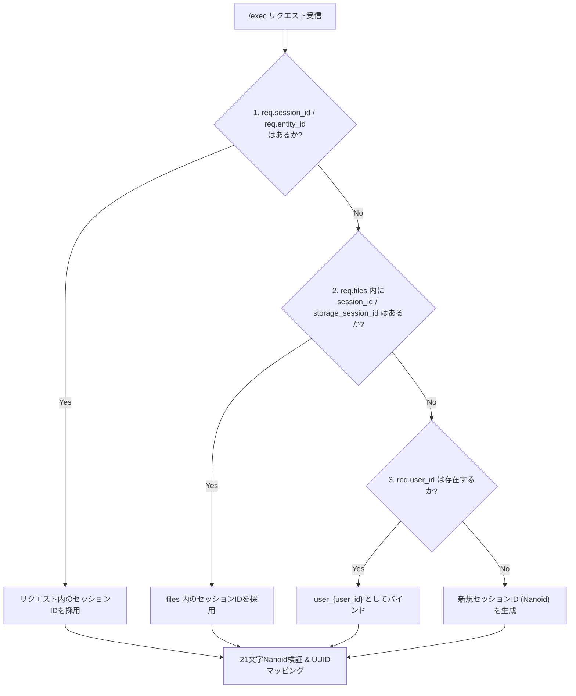
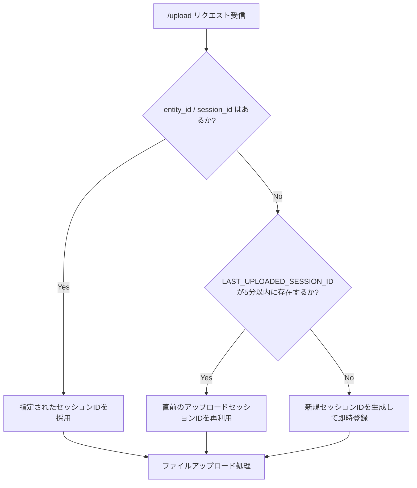

# Session ID Resolution & Fallback (セッションID解決とフォールバック)

## 1. 概要

LibreChatのクライアント側ツール（`@librechat/agents` 等）では、ファイルを添付しないコード実行時などに、リクエストルートの `session_id` が省略されて送信される仕様上の特性があります。

本APIでは、チャット間のセッション分離を保証しつつ、同一チャット内でのステートフルな実行を維持するため、以下の解決フローを実装しています。

## 2. セッションID解決フロー（`/exec` エンドポイント）

### 優先順位（設計不変条件）
1. **リクエスト直接指定**: `session_id` または `entity_id`。
2. **ファイルメタデータ**: `files` 配下の各要素に含まれる `session_id` もしくは `storage_session_id`。
3. **ユーザーIDバインド**: `user_id` が存在する場合は `user_{user_id}`。
4. **新規生成**: 上記すべてが欠落した場合、新規セッションIDを生成。

> [!IMPORTANT]
> **チャット分離保証**: グローバル変数 `LAST_UPLOADED_SESSION_ID` による `/exec` でのフォールバックは、チャット間・ユーザ間のセッション汚染を引き起こすため**廃止**されました。セッション情報が一切ないリクエストは、常に新規セッションを生成します。

## 3. `/upload` エンドポイントのセッション解決

アップロードエンドポイントでは、同一チャット内での連続アップロード（並行処理）を支援するため、`LAST_UPLOADED_SESSION_ID` によるフォールバックを維持しています。

## 4. LibreChatの実際の送信パターン（ログ実証済み）

| フィールド | 送信状況 | 備考 |
|---|---|---|
| `session_id` | ほぼ常に `None` | LibreChatは `/exec` で `session_id` を送信しない |
| `entity_id` | ほぼ常に `None` | 同上 |
| `user_id` | 常に `None` | 現行のLibreChatでは未送信 |
| `files[].storage_session_id` | ✅ 送信される | RCEレスポンスの `session_id` を次のリクエストで再送 |

このため、同一チャット内でのセッション継続は主に `files[].storage_session_id` に依存しています。

## 5. 関連ドキュメント
* [Nanoid ID Mapping](./nanoid-mapping.md) - 21文字Nanoid変換仕様
* [Concurrency Control](../architecture/concurrency.md) - 並行セッションロック
