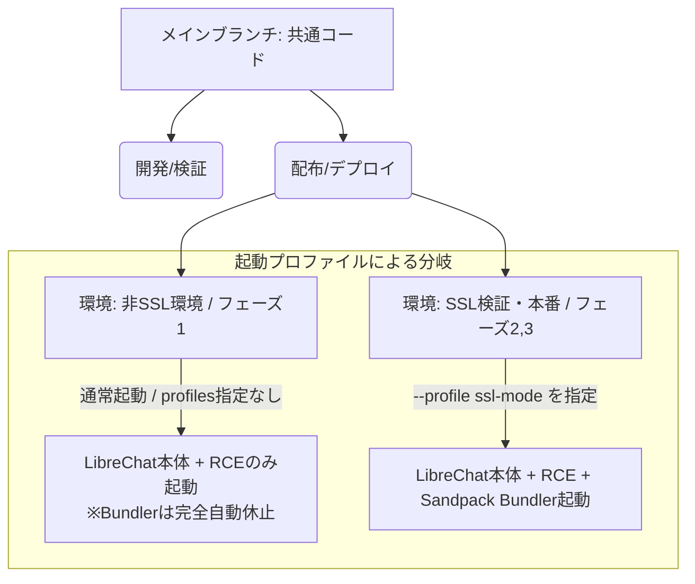

# LibreChat Artifacts マルチ環境運用ガイド
## 〜 1つのブランチ ＋ 環境（設定値）の分離による段階的導入設計 〜

本ドキュメントは、LibreChatのArtifacts機能（Sandpack Bundler）を、インフラの暗号化（SSL/TLS）状況や検証フェーズに合わせて、**ソースコードのブランチを分岐させずに単一のコードベース（メインブランチ）でエレガントに切り替えて管理・運用するための開発計画およびガイドライン**です。

---

## 1. 全体ロードマップと開発計画

ダブルメンテナンス（複数ブランチによる同一コードの重複保守）の発生をゼロにするため、設定値（環境変数）および Docker Compose の **Profiles（プロファイル）機能** を活用した「環境分離」で段階的な導入を推進します。



### 開発・運用フェーズ計画
- **フェーズ1（現在）**: 非暗号化（HTTP）環境での運用。Artifactsを安全かつリソース消費ゼロで完全無効化し、データ分析（RCE）と通常のチャットに専念。
- **フェーズ2（移行期）**: Caddyによるローカル自己署名証明書を用いた仮HTTPSテスト環境の構築。手元のブラウザで例外許可を行い、Artifactsのレンダリング・動作検証を実施。
- **フェーズ3（本番）**: ドメイン取得と Let's Encrypt 等による正規SSL証明書の適用。全クライアントPCやモバイル環境から、警告なしでセキュアにフル機能（Artifacts）を利用。

---

## 2. Docker Compose Profiles を用いた構成設計

単一のブランチで「コンテナ起動の有無」をスマートに切り替えるため、`docker-compose.librechat.yml` でプロファイルを設定します。

### 2.1 `docker-compose.librechat.yml` の設計案
`sandpack-bundler` サービスに `profiles` 属性を付与します。

```yaml
services:
  # ... (他のapi, mongodb, meilisearch, librechatサービスは省略せずに稼働)

  # ---------------------------------------------------------------------------
  # Sandpack Bundler Service (For offline/local Artifacts rendering)
  # ---------------------------------------------------------------------------
  sandpack-bundler:
    image: ghcr.io/librechat-ai/codesandbox-client/bundler:latest
    container_name: sandpack-bundler
    restart: always
    ports:
      - "8080:80"
    profiles:
      - ssl-mode  # ★「ssl-mode」プロファイル指定時のみコンテナを起動する
    networks:
      - librechat-network
```

### 2.2 起動・管理コマンドの統一

利用者の環境に合わせてコマンドオプションを1つ付け加えるだけで、完全に挙動を切り替えることができます。

#### ① 非SSL環境（フェーズ1）での起動コマンド
`sandpack-bundler` コンテナは自動的にスキップされ、起動しません（余計なメモリ・CPUリソースを一切消費しません）。
```bash
docker compose -f docker-compose.yml -f docker-compose.librechat.yml up -d
```

#### ② SSL検証・本番環境（フェーズ2・3）での起動コマンド
`--profile ssl-mode` を追加するだけで、Sandpack Bundler を含めたフルスタック構成が自動的に起動します。
```bash
docker compose -f docker-compose.yml -f docker-compose.librechat.yml --profile ssl-mode up -d
```

### 2.3 エージェント（Agents）UIでの機能無効化手順（推奨）

非SSL環境（フェーズ1）では、環境変数の無効化に加えて、チャット画面上での不要な「接続エラー（TIME_OUT）」画面の発生を防ぐため、**AIエージェントの作成・編集画面（UI）から直接Artifacts機能をオフにする運用**を強く推奨します。

1. LibreChatの画面左側のメニューから **「Agents（エージェント）」** または **「エージェント・マーケットプレイス」** を開きます。
2. 使用するエージェントの編集（ペンアイコン）画面を開きます。
3. エージェントの能力設定（**Capabilities**）一覧にある **「Artifacts」** のトグルスイッチを **オフ** にします。
4. 設定を保存します。

このUI操作を行うことで、そのエージェントはチャット中にArtifactsを生成しなくなり、画面右側にプレビューパネルが開こうとすること自体がなくなるため、不要なネットワークタイムアウトエラーを美しく完全に回避できます。

---

## 3. 環境変数（.env）の分離設計

接続先のアドレスはソースコードにハードコーディングせず、配布テンプレートである `.env.librechat` で切り替え手順を明確にして提供します。

### `.env.librechat`（配布用テンプレート）の設定ガイド
```env
# =============================================================================
# ■ オフライン・ローカル環境用 Sandpack バンドラー設定
# =============================================================================
# Artifacts（React等のUI描画機能）をローカル環境で動作させるための設定です。
#
# 【フェーズ1: 非SSL環境 (デフォルト)】
# 他のPC等のブラウザから http://blue-two.local:3000 でアクセスする場合、
# ブラウザのセキュリティ制限（Service Worker制限）によりローカルBundlerへの通信はブロックされます。
# そのため、以下の設定値は「指定なし（空値）」にするかコメントアウトしてください。
# SANDPACK_BUNDLER_URL=

# 【フェーズ2・3: SSL環境 (HTTPS移行時)】
# Caddy等を用いてHTTPS化（例: https://blue-two.local:3000）を完了した場合は、
# コメントアウトを解除し、HTTPS形式の接続先を指定してください。
# SANDPACK_BUNDLER_URL=https://blue-two.local:8080
```

---

## 4. フェーズ2（自己署名SSLテスト）に向けたCaddy構成計画

SSL環境への移行準備（フェーズ2）として、最も簡単かつ自動でローカルSSL証明書を発行・管理できる **Caddy** をリバースプロキシとして導入する手順案です。

```
[クライアントブラウザ] 
      │ (HTTPS通信 / 暗号化)
      ▼
┌────────────── Caddy (リバースプロキシ) ──────────────┐
│  • localhost:443      ──►  librechat:3080            │
│  • localhost:8443     ──►  sandpack-bundler:80       │
└─────────────────────────────────────────────────────┘
```

### 4.1 `Caddyfile` の設計案
プロジェクト直下に `Caddyfile` を作成します。
```caddy
# LibreChat本体のHTTPS化（ポート443）
blue-two.local:443 {
    reverse_proxy librechat:3080
    
    # 自己署名証明書の自動生成（検証用）
    tls internal
}

# Sandpack BundlerのHTTPS化（ポート8443）
blue-two.local:8443 {
    reverse_proxy sandpack-bundler:80
    
    # 自己署名証明書の自動生成（検証用）
    tls internal
}
```

### 4.2 自己署名SSL環境でのテスト手順と注意点

自己署名証明書（`tls internal`）を使用する場合、ブラウザの「詳細設定からアクセス（一時的な例外許可）」を行うだけでは、ブラウザのセキュリティポリシー（特に Chrome や Firefox）によって **Service Worker の登録が引き続き拒否される** ことがあります。

そのため、以下の手順で Caddy が生成する「ローカル認証局（CA）のルート証明書」を、お使いのPC（ブラウザ）にインポートすることで、完全に信頼された安全な通信としてパスさせる必要があります。

#### 1. CaddyのルートCA証明書の取得
Caddyは起動時に、以下のコンテナ内ディレクトリにローカルルートCA証明書（`root.crt`）を生成します。
- 保存先: `/data/caddy/pki/authorities/local/root.crt`

これをホストPCにコピーします（Dockerのボリュームマウント等を利用するか、`docker cp` コマンドで取り出します）。
```bash
docker cp caddy:/data/caddy/pki/authorities/local/root.crt ./root.crt
```

#### 2. クライアントPCへのインストール（信頼）
取り出した `root.crt` をブラウザやOSの証明書ストアにインストールします。

- **Windows**: `root.crt` をダブルクリックし、「証明書のインストール」から「信頼されたルート証明機関」ストアを選択してインストールします。
- **macOS**: キーチェーンアクセスを開き、「システム」または「ログイン」の「証明書」に `root.crt` をドラッグ＆ドロップし、ダブルクリックして信頼設定を「常に信頼」に変更します。
- **Chrome / Edge / Firefox (個別対応)**: 設定 ＞ 「プライバシーとセキュリティ」 ＞ 「セキュリティ」 ＞ 「証明書の管理」 ＞ 「認証局」タブから `root.crt` をインポートし、「この認証局によるウェブサイトの識別を信頼する」にチェックを入れます。

#### 3. 動作テストの実行
1. ルート証明書のインポート完了後、ブラウザを一度完全に閉じて再起動します。
2. **`https://blue-two.local:3000`** にアクセスします（アドレスバーの警告が消え、完全に鍵マークのついた安全な接続になっていることを確認します）。
3. これにより、ブラウザは完全なセキュアコンテキストとしてSandpackを認識するため、Service Workerがエラーなく正常にアクティベートされ、Artifactsが100%機能するようになります。

---

## 5. 本設計の保守的メリット

この「1つのブランチ ＋ 環境（設定値）の分離」アプローチを採用することにより、以下の多大な保守的メリットが約束されます。

1. **シングル・ソース・オブ・トゥルース（信頼できる唯一の情報源）**:
   コードベースが1つになるため、LibreChatのアップグレードやセキュリティパッチの適用作業は常にメインブランチ上での1回のみで完了します。
2. **安全なデフォルト値（フェーズ1）**:
   初期状態では最も安全かつエラーを起こさない「非SSL・軽量モード」で動作するため、導入障壁が非常に低くなります。
3. **シームレスな移行ロードマップ**:
   ユーザーが将来的にインフラをSSL化したくなった場合も、新しいブランチをチェックアウトしたりコードを再取得したりする必要がなく、`.env` の編集と起動オプションの追加だけでスムーズにフェーズ2・3にスケールアップ可能です。
